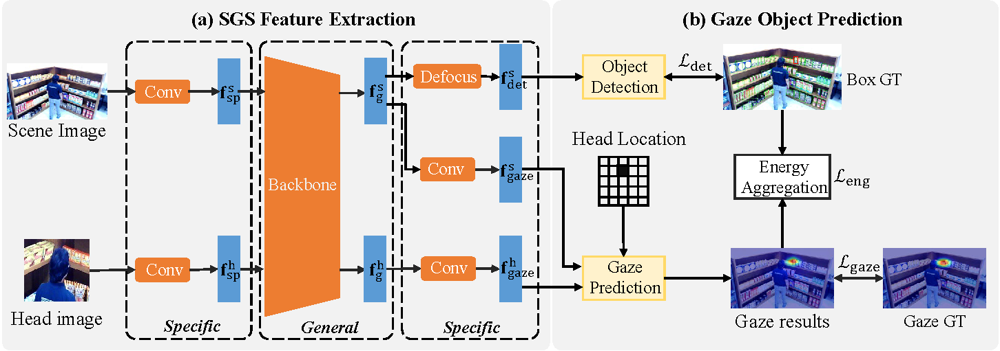

## GaTector: A Unified Framework for Gaze Object Prediction
This repository is the official implementation of GaTector, which studies the newly proposed task, gaze object prediction. In this work, we build a novel framework named GaTector to tackle the gaze object prediction problem in a unified way. Particularly, a specific-general-specific (SGS) feature extractor is firstly proposed to utilize a shared backbone to extract general features for both scene and head images. To better consider the specificity of inputs and tasks, SGS introduces two input-specific blocks before the shared backbone and three task-specific blocks after the shared backbone. Specifically, a novel defocus layer is designed to generate object-specific features for object detection task without losing information or requiring extra computations. Moreover, the energy aggregation loss is introduced to guide the gaze heatmap to concentrate on the stared box. In the end, we propose a novel mDAP metric that can reveal the difference between boxes even when they share no overlapping area. Extensive experiments on the GOO dataset verify the superiority of our method in all three tracks, i.e., object detection, gaze estimation, and gaze object prediction.


## Data Preparation
The GOO dataset contains two subsets: GOO-Sync and GOO-Real. 

You can download GOO-synth from the following links:

Train:
[part0](https://zenodo.org/record/5501686/files/goosynth_train.zip?download=1), [part1](https://zenodo.org/record/5501754/files/goosynth_train.z01?download=1), [part2](https://zenodo.org/record/5501788/files/goosynth_train.z02?download=1), [part3](https://zenodo.org/record/5501941/files/goosynth_train.z03?download=1), [part4](https://zenodo.org/record/5502388/files/goosynth_train.z04?download=1), [part5](https://zenodo.org/record/5504008/files/goosynth_train.z05?download=1), [part6](https://zenodo.org/record/5507589/files/goosynth_train.z06?download=1), [part7](https://zenodo.org/record/5511063/files/goosynth_train.z07?download=1), [part8](https://zenodo.org/record/5511688/files/goosynth_train.z08?download=1), [part9](https://zenodo.org/record/5512157/files/goosynth_train.z09?download=1)

Test:
[GOOSynth-Test](https://pan.baidu.com/s/1fhHgXIN5W6VSll7DTO0F4w) (code:hxv9)

Annotation file:

[goosynth_train_v2_no_segm](https://pan.baidu.com/s/1A38TTOQ-ESc8OtqFETLVQQ) (code:9rn2)

[goosynth_test_v2_no_segm](https://pan.baidu.com/s/1AYtPkw9mCLfHb8vp1Dd2mg) (code:tuvn)

You can also download GOO-synth from OneDrive:

Train:
[part1](https://mailnwpueducn-my.sharepoint.com/:u:/g/personal/yangle_nwpu_mail_nwpu_edu_cn/ESk3KTXgDSFMmVcBW_EMAssBvxBf-eBSMK39g8yqFlRVgA?e=dSIXsd),
[part2](https://mailnwpueducn-my.sharepoint.com/:u:/g/personal/yangle_nwpu_mail_nwpu_edu_cn/EVoQzdFRQ85Bok0tmVpPLLcBk-adZBEcuRa-xp20sxVICw?e=hq5bwi),
[part3](https://mailnwpueducn-my.sharepoint.com/:u:/g/personal/yangle_nwpu_mail_nwpu_edu_cn/EUHIrsNLq_pHm2s7E8V9O5IBWBmvf5qI9jFue7wYOVNhyw?e=GYbTaW),
[part4](https://mailnwpueducn-my.sharepoint.com/:u:/g/personal/yangle_nwpu_mail_nwpu_edu_cn/EVTOQM6kkFJJm5v_h7K8r88BF2RlXa76DfE88v3rJkw70Q?e=NPuBzO),
[part5](https://mailnwpueducn-my.sharepoint.com/:u:/g/personal/yangle_nwpu_mail_nwpu_edu_cn/ESLLYmaimxlIgCW4Hy_Q9LMBrMS6ouPsAwWDYf7kUStElA?e=bKvZYd),
[part6](https://mailnwpueducn-my.sharepoint.com/:u:/g/personal/yangle_nwpu_mail_nwpu_edu_cn/ETevP-Nko6BAjBTidy-YsIYB8_145u7SeISKYtIr4AqKVg?e=0o9GOq),
[part7](https://mailnwpueducn-my.sharepoint.com/:u:/g/personal/yangle_nwpu_mail_nwpu_edu_cn/EUhglUujYbFIqYEOSgp5R5kBVZqvz0a4GdGogqlXXm1JAA?e=30ysd6),
[part8](https://mailnwpueducn-my.sharepoint.com/:u:/g/personal/yangle_nwpu_mail_nwpu_edu_cn/EY5AI0TLdrtMkN_pqV3FOzABtSPlnDOcjNT7QMEtDC5iXg?e=zI13Cp),
[part9](https://mailnwpueducn-my.sharepoint.com/:u:/g/personal/yangle_nwpu_mail_nwpu_edu_cn/EXHwQT0GRStFqSML6s8uW6kBLuFF8VjTf_opBg_ivtbUBQ?e=e0Agrv),
[part10](https://mailnwpueducn-my.sharepoint.com/:u:/g/personal/yangle_nwpu_mail_nwpu_edu_cn/EZ1LC_GF9a9EtUnofjLUtW4Bhb_-dg2bSgx6UYGS1piLrA?e=yawdDf),
[part11](https://mailnwpueducn-my.sharepoint.com/:u:/g/personal/yangle_nwpu_mail_nwpu_edu_cn/ERLtx5hBM5tLtUPAjs2yvYgBQ8CrEW4S8zd9HKzow7jX2w?e=BTCvl6)


Test:
[GOOsynth-test_data](https://mailnwpueducn-my.sharepoint.com/:u:/g/personal/yangle_nwpu_mail_nwpu_edu_cn/EQ5DC43-aYVOt3-Jmy5ZIscBFd0yGvVeyiWOoHLFwZsJ4Q)

Annotation file:

[GOOsynth-train_data_Annotation](https://mailnwpueducn-my.sharepoint.com/:u:/g/personal/yangle_nwpu_mail_nwpu_edu_cn/ET6h-STtBiVIn7jpwOP8bzEB__u-FEmwT8wXLKtTUw865g)

[GOOsynth-test_data_Annotation](https://mailnwpueducn-my.sharepoint.com/:u:/g/personal/yangle_nwpu_mail_nwpu_edu_cn/EW3HgRNFGPVHmaoYeFwhY1gB8UxwdEWSr55UwDaxwYvp1w)

You can download GOO-Real from Baidu Netdisk:

Train:
[GOOreal-train_data](https://pan.baidu.com/s/1kSiOW2mvJ7m7Rh-MW3H8KA?pwd=6j5l)(code:6j5l)

Test:
[GOOreal-test_data](https://pan.baidu.com/s/1rzBja86SjmYKJjSOFbKKHA?pwd=aa4i)(code:aa4i)

Annotation file:

[GOOreal-train_data_Annotation](https://pan.baidu.com/s/1RGV5RX8Hq4rAUp4f8asM8A?pwd=xdvm)(code:xdvm)

[GOOreal-test_data_Annotation](https://pan.baidu.com/s/1atpkeLhNK6X6yXUUa9Otag?pwd=a76s)(code:a76s)

You can also download GOO-Real from OneDrive:

Train:
[GOOreal-train_data](https://mailnwpueducn-my.sharepoint.com/:u:/g/personal/yangle_nwpu_mail_nwpu_edu_cn/ETjRM4To-QxNtp9a4hMTTVwBAfBJ8e6Hs7TNv5RzsJgj2w)

Test:
[GOOreal-test_data](https://mailnwpueducn-my.sharepoint.com/:u:/g/personal/yangle_nwpu_mail_nwpu_edu_cn/EXlBBBnd2khPk7S0_FKKGtQBCoIKoHSu7SmpdpxTAICpdw)

Annotation file:

[GOOreal-train_data_Annotation](https://mailnwpueducn-my.sharepoint.com/:u:/g/personal/yangle_nwpu_mail_nwpu_edu_cn/EZEpAPUtWSlGoS7DOwuV1G8BvhYuWZL_NLwqkDJe3sZ7JQ)

[GOOreal-test_data_Annotation](https://mailnwpueducn-my.sharepoint.com/:u:/g/personal/yangle_nwpu_mail_nwpu_edu_cn/EfCtqSoZxnxEgPKwB_IfmfcBvap1R8d3o8wjxUY6tPr0fw)

~~~~
Please ensure the data structure is as below

├── goo_dataset
   └── goosynth
       └── picklefile
          ├── goosynth_test_v2_no_segm.pkl
          ├── goosynth_train_v2_no_segm.pkl
       └── test
          └── images
             ├── 0.png
             ├── 1.png
             ├── ...
             ├── 19199.png
       └── train
          └── images
             ├── 0.png
             ├── 1.png
             ├── ...
             ├── 172799.png
   └── gooreal
      └── train_data
         ├── 0.png
         ├── 1.png
         ├── ...
         ├── 3608.png
      └── test_data
         ├── 3609.png
         ├── 3610.png
         ├── ...
         ├── 4512.png
      ├── train.pickle
      ├── test.pickle

~~~~

##Environment Preparation
Requirements

```
conda env create -n Gatector -f environment.yaml
```

## Training & Inference

To carry out experiments on the GOO dataset, please follow these commands:

Experiments on GOO-Synth:
```train
python main.py --train_mode 0 --train_dir './goo_dataset/goosynth/train/images/' --train_annotation './goo_dataset/goosynth/picklefile/goosynth_train_v2_no_segm.pkl' --test_dir './goo_dataset/goosynth/test/images/' --test_annotation './goo_dataset/goosynth/picklefile/goosynth_test_v2_no_segm.pkl'
```
Experiments on GOO-Real:
```train
python main.py --train_mode 1 --train_dir './goo_dataset/gooreal/train_data/' --train_annotation './goo_dataset/gooreal/train.pickle' --test_dir './goo_dataset/gooreal/test_data/' --test_annotation './goo_dataset/gooreal/test.pickle/'
```

## Pre-trained Models
You can download pretrained models from baiduyun

[Pre-trained Models](https://pan.baidu.com/s/1KxVGSS8MXhEwyEH5wAPPsw) (code:xfyk). 

## Get_Result
Object detection result

get mAP
```
python get_map.py --train_mode 1 --flag 0 --dataset 1
```
get wUOC
```
python get_map.py --train_mode 1 --flag 1 --dataset 1
```

Object detection + gaze estimation 

When you training the model, the index of gaze will be saved in gaze_performence.txt. 

get mAP
```
python get_map.py --train_mode 0 --flag 0 --dataset 0
```
get wUOC
```
python get_map.py --train_mode 0 --flag 1 --dataset 0
```

## Results

Our model achieves the following performance on GOOSynth dataset:

|  AUC  | Dist. | Ang.  |  AP  | AP50 | AP75 | Gaze object prediction mDAP (%) |
| :---: | :---: | :---: | :--: | :--: | :--: | :-----------------------------: |
| 0.957 | 0.073 | 14.91 | 56.8 | 95.3 | 62.5 |              28.5               |


## Citation

```
@inproceedings{wang2022gatector,
 title={GaTector: A Unified Framework for Gaze Object Prediction},
 author={Wang, Binglu and Hu, Tao and Li, Baoshan and Chen, Xiaojuan and Zhang, Zhijie},
 booktitle={Proceedings of the IEEE/CVF Conference on Computer Vision and Pattern Recognition},
 pages={19588--19597},
 year={2022}
}
```